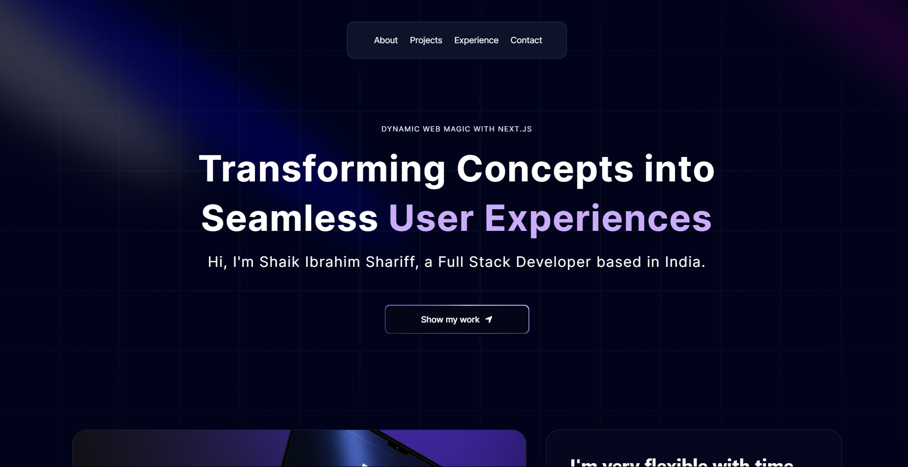

# Ibrahim's Portfolio Website 🚀

Welcome to My Personal Portfolio Website! This website showcases my skills, projects, and experiences in web development and related fields.



## Table of Contents 📋

- [About ℹ️](#about)
- [Features ✨](#features)
- [Technologies Used 💻](#technologies-used)
- [Getting Started 🚀](#getting-started)
- [Usage 🖥️](#usage)
- [Contributing 🤝](#contributing)
- [License 📝](#license)

## About ℹ️

This portfolio website is designed and developed by me to highlight my expertise, projects, and achievements in web development. It provides an overview of my skills and experiences to potential employers, clients, and collaborators.

## Features ✨

- **Responsive Design**: The website is fully responsive and optimized for various screen sizes, ensuring a seamless user experience across devices.
- **Portfolio Section**: Showcase of Ibrahim's projects with descriptions, images, and links to live demos or GitHub repositories.
- **About Me Section**: Brief introduction of Ibrahim, his skills, and professional background.
- **Contact Section**: Contact form for visitors to reach out to Ibrahim directly for inquiries, collaborations, or job opportunities.
- **Navigation Menu**: Easy navigation with a fixed menu that allows users to smoothly move between different sections of the website.

## Technologies Used 💻

- **HTML5**: Markup language for structuring the website's content.
- **CSS3**: Styling language for designing the website's layout and appearance.
- **JavaScript**: Programming language for adding interactivity and dynamic elements to the website.
- **ReactJS**: JavaScript library for building user interfaces, used for creating reusable components and managing state.
- **NextJS**: The library for web and native user interfaces.
- **Vercel**: Deployment platform used to host the portfolio website.


## Getting Started 🚀

To run the portfolio website locally, follow these steps:

1. Clone the repository:

```bash
git clone https://github.com/your-username/your-portfolio.git
```

2. Navigate to the project directory:

```bash
cd your-portfolio
```

3. Install dependencies:

```bash
npm install
```

4. Start the development server:

```bash
npm start
```

5. Open your web browser and visit `http://localhost:3000` to view the website.

## Usage 🖥️

Feel free to explore the website and navigate through different sections to learn more about Ibrahim's skills, projects, and experiences. If you have any inquiries or would like to collaborate, you can use the contact form to get in touch with Ibrahim directly.

## Contributing 🤝

Contributions to the portfolio website are welcome! If you have any suggestions for improvements, new features, or bug fixes, please open an issue or submit a pull request on GitHub.

## License 📝

This project is licensed under the MIT License - see the [LICENSE](LICENSE) file for details.

---

Feel free to customize this README according to your preferences and any additional features or details you want to highlight about your portfolio website.
